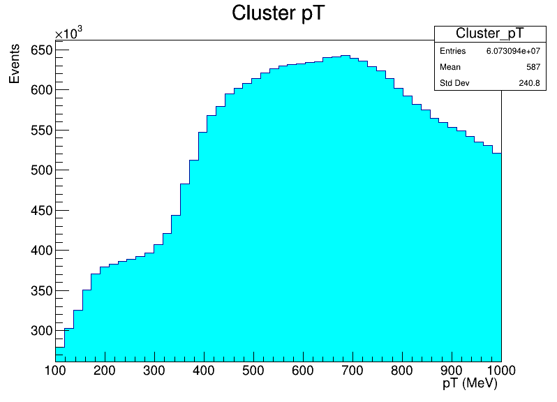
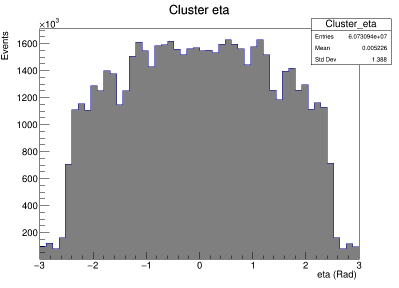
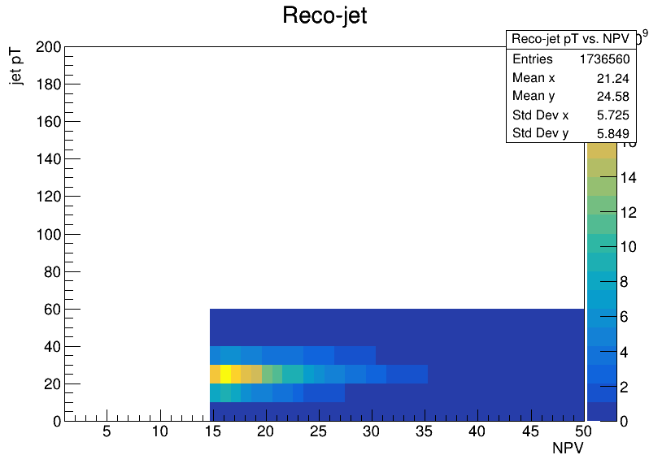
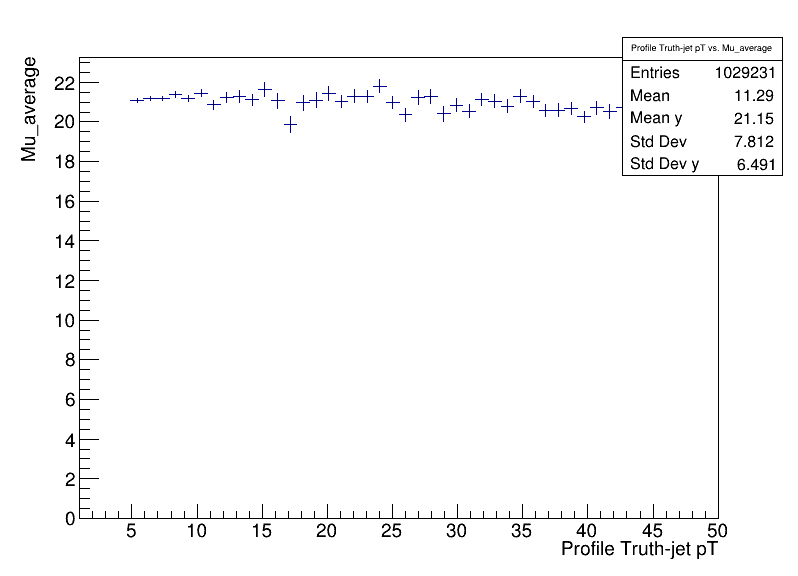
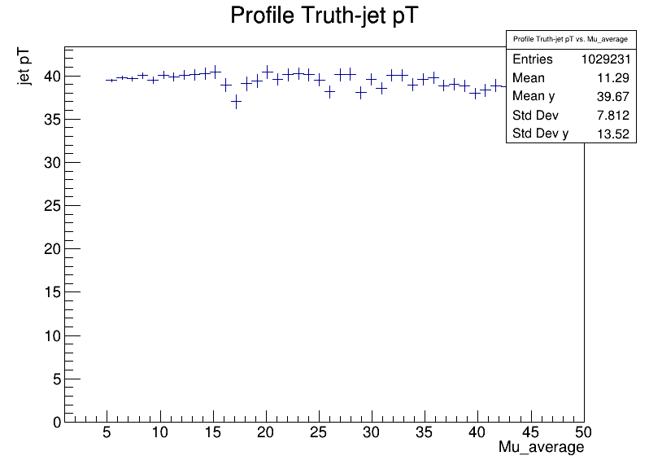
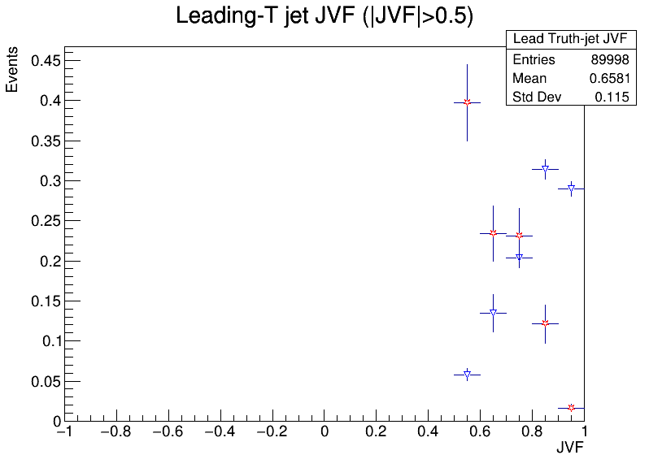

# Fisica_Experimental_Particulas_2021_2
This respository is oriented to resolve the activities related to the course

## Tracks and Clusters
### Exercise 1 & 2 
> We make three histograms through the **'TC_Ex1_2_macro.cpp'** file, so these graphs are as following:
>   
>
>These 3 histogram are about 1. Number of average interaction per bunch-crossing (Events vs mu_average) 2. Number of primary vertices per event (Events vs NPV) and 3. A 2D histogram to analyze the number of primary vertices per number of average interaction (NPV vs mu_average)
### Exercise 3
> Because tracks and clusters information is not such an event variable, but objects with some kinematical information, we make a 2D histogram to view how is the behavior related to the previous variable and the number of tranks and clusters per event, this is made in **'TC_Ex3_macro.cpp'** file and it's shown in following images:
> 
>    
### Exercise 4, 5 & 6
> Now we print histograms related to the track and cluster variables, this information is associeted when particles go throughout trackers and calorimeters, moreover it's compared to particle variables that correspond to simulations of experimental results. So this was made through **'TC_Ex4_5_6_macro.cpp'** file.
> * **Track Variables**
> 
>  
>   
>
> * **Cluster Variables**
> 
>  
>  
> 
> * **Particle Variables**
> 
>  
>  
> 
> 
> Finally, in both track and cluster variable are found 'pT', 'eta', 'phi' , 'm', and 'vtx' in the case of track, this correspond to certain beam's properties, i.e., **transversal mommentum**, **psedu-rapidity** (η), **azimuthal angle** (φ) and **mass** respectively, 'vtx' is the vertex where come particles from. On other hand, in particle variables we found 'pdgID' corresponding to **Particle Data Group ID** which sort each particle.

## Jets
### Exercise 1

>    

### Exercise 2

>    
>    

### Exercise 3

>  
>   
