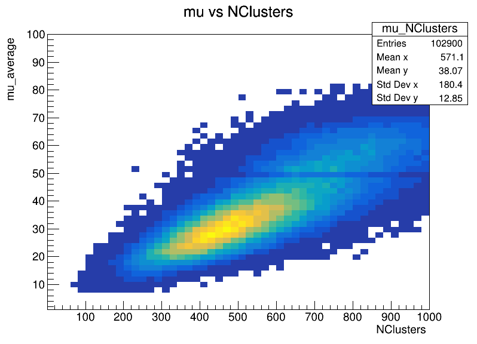

# Fisica_Experimental_Particulas_2021_2
This respository is oriented to resolve the activities related to the course

## Tracks and Clusters
### Exercise 1 & 2 
> We make three histograms through the 'TC_Ex1_2_macro.cpp' file, so these graphs are as following:
>   
>
>These 3 histogram are about 1. Number of average interaction per bunch-crossing (Events vs mu_average) 2. Number of primary vertices per event (Events vs NPV) and 3. A 2D histogram to analyze the number of primary vertices per number of average interaction (NPV vs mu_average)
### Exercise 3
> Because tracks and clusters information is not such an event variable, but objects with some kinematical information, we make a 2D histogram to view how is the behavior related to the previous variable and the number of tranks and clusters per event, this is made in 'TC_Ex3_macro.cpp' file and it's shown in following images:
> 
>    
### Exercise 4, 5 & 6
> 
